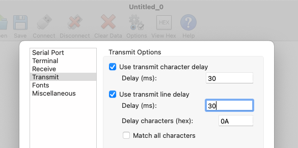

# LOAD CO

A two-part project to help load binary files onto a Tandy TRS-80 M100 or T102.

Being a new-ish Tandy user, I am still finding my way around, but as far as I can see there's no easy way to transfer non-ASCII files from a computer to a Tandy. ASCII is easy enough, but binary files... nope. So I came up first with a method that has apparently been used, in various forms, by many before me: produce a BASIC program that sideloads the binary. While it works well enough – and is still needed to bootstrap any further attempt at making things easier – it rapidly became obvious that large binary files wouldn't work: by the time the HEX data was loaded as a RAM file, there wasn't any RAM left. Oops. So I decided to hack together a purely Serial solution.

Two parts are required: a small BASIC program that receives data from the desktop computer and POKEs it in RAM, and a desktop application that lets you pick a `.co` file, produced with my [8085 assembler](https://github.com/Kongduino/8085asm), calculates the memory needed, and sends it – SLOWLY! – to the T102. I need to work a little more on the BASIC program, `SNDBIN.BA`, but it works, and even has a nice progress bar! :-)

## INSTALLATION

First transfer the BASIC program, `SNDBIN.BA` to the Tandy via the TERMINAL on the Tandy, and a serial application (I recommend CoolTerm, but your mileage and all that...). One caveat – at 19,200 baud, the transfer is often too fast for TERMINAL. In CoolTerm, I slow down the transmission of chars and lines a little:

The desktop application was developed with Xojo. I haven't tested yet the Linux version, and I don't own or use a Windows machine, so I'll leave that to people who do... The source code is provided, as well as zip files of the 3 compiled apps (Mac Universal applications are too big so I made 2 separate versions). SHA256 digests are provided.

At startup the `.co` files present in the same folder as the application are loaded. You can drag-and-drop a folder, or file, to load `.co` files present in that folder. You can click on the path above the listbox to open that folder. When you select a file, it will calculate how much space is needed and will tell you how to reset `HIMEM`:

Run this command on the Tandy. Then click send. You're not there yet – you have to pick a serial port, and make sure the Tandy is ready – `SNDBIN.BA` must be running before you do anything else.

And indeed after a while the binary will be fully loaded in RAM:

And it does indeed work! Trust but verify.

